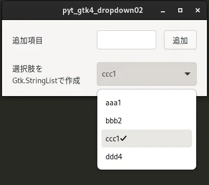

# 02_sort

[戻る](../README.md)

 

## 内容 

Gtk.Entryに入力したテキストをGtk.StringListに項目として追加する。Gtk.DropDownの選択肢として表示する時に、Gtk.StringListをソートして表示する。

※ 画像中で項目は、ccc1 - bbb2 - aaa3 - ddd4の順に追加したが、Gtk.DropDownの選択肢はアルファベット順に並んでいる。

 

## 参考にしたHP

[戻る](../README.md)
